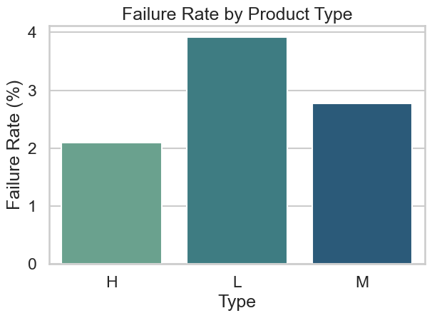

# Predictive Maintenance Analysis (AI4I 2020)

---

## 📄 Project Overview

This project focuses on **Predictive Maintenance** using the **AI4I 2020 dataset**, aiming to analyze machine operational data and predict potential failures.  
It combines **SQL Server queries, Python analysis, chart visualizations, and a Power BI dashboard** to provide comprehensive insights.

---

## 🗂 Project Structure

- `queries.sql` : Advanced SQL queries for exploratory analysis and feature extraction.
- `analysis.ipynb` : Jupyter Notebook for full data preparation, EDA, and all charts generation.
- `charts/` : Folder where all charts are saved.
- `PowerBI_Dashboard.pbix` : Dashboard file (currently in progress).

---

## 📊 Charts Overview

The following charts are automatically generated in the `/charts` folder and displayed below:

---

### 1️. Tool Wear Distribution by Failure

- **X-axis:** Tool_wear_min (0–245 min)  
- **Y-axis:** Count of samples  
- Blue = Machine_failure 0, Green = Machine_failure 1  
- Most non-failure samples between 0–60 min; failures are rare and appear at lower values.

### 2️. Torque vs Failure & RPM vs Failure

- **Torque:** 0 = ~20–65 Nm, 1 = mostly <15 Nm  
- **RPM:** 0 = 1200–2600 rpm, 1 = 1350–2400 rpm  
- Clear separation indicates Torque and RPM are strong failure predictors.

### 3️. Temperature Difference vs Machine Failure

- Temperature difference slightly higher for failures (~8–12 K).  
- Some correlation with failure, but variance is high.

### 4️. Failure Rate by Product Type

- Types: H (~2.1%), L (~3.9%), M (~2.6%)  
- Type L shows the highest risk.

### 5️. Machine Failure Rate (Pie)

- Majority (~96–97%) without failure.  
- Failure rate ~3–4%; still important to monitor.

### 6️. Severity Score Distribution

- Score ranges 140–400, most between 180–280.  
- Higher values indicate more critical cases; peak around 210–260.

### 7️. Torque vs Temperature Difference

- Higher torque + higher temperature difference correlate with higher risk.  
- Combined features improve failure prediction.

### 8️. Failure Type Distribution

- HDF (~110–115), OSF (~95–100), PWF (~95), TWF (~45), RNF (~20)  
- Prioritize maintenance based on most frequent failure types.

### 9️. Correlation Heatmap

- Strong positive correlation: Air_temperature_K vs Temp_Diff (~0.70)  
- Severity_Score moderately correlated with Temp_Diff (~0.20–0.30)  
- Key factors for predicting failure.

### 10. RPM vs Torque & Severity Score by Failure
.png)  

- RPM inversely related to Torque.  
- Failure 1 tends to have higher Severity_Score.  
- Useful for proactive maintenance strategies.

---

## 🔍 Findings & Recommendations

1. **Low overall failure rate (~3–4%)**, but continuous monitoring is essential.  
2. **Type L machines** are more prone to failure; consider targeted preventive maintenance.  
3. **Torque, RPM, and Temp Difference** are strong indicators for predictive models.  
4. **Severity Score metric** effectively identifies high-risk machines.  
5. Use **failure type distribution** to prioritize maintenance resources.  
6. Environmental conditions (moderate ambient temperature) can influence failure rate; adjust operational parameters accordingly.  
7. Implement **Power BI dashboard** for real-time monitoring and decision support.

---

## 📌 Notes

- Colors and grouping in charts help distinguish Machine_failure = 0 and 1.  
- Dataset cleaned and enhanced with feature engineering (Temp_Diff, Severity_Score, Air_Condition).  
- SQL queries support detailed exploration and cross-validation of Python analysis.

---

## 🧑‍💻 Author

**👨‍🔬 Mohamed Emad**  
Data Analyst | Mechanical Engineer Background  
